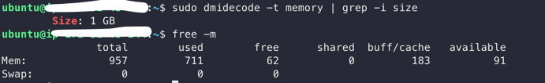

# 1. 시스템 구성 정보 확인하기

시스템 문제를 파악할 때 가장 기본이 되는 것은 시스템이 어떻게 구성되어 있느냐를 파악하는 것이다. CPU는 어떤 것을 사용하는지, 메모리는 어느정도 용량으로 장착되어 있는지 등등 시스템의 정보를 알아야 시스템 분석을 시작할 수 있다.

####  1-1. 커널 정보 확인하기
```
# uname -a
# dmesg | grep -i kernel | more
```

#### 1-2. Cpu 정보 확인하기
시스템의 하드웨어 정보 확인
즉, 사용하고 있는 시스템이 어떤 제조사에서 만든 제품인지, 메모리는 물리적으로 어떻게 구성되어 있는지 등을 확인

```
# man 
: 해당 명령어가 하는 역할, 각종 옵션, 그리고 예제 등 멸령어에 대한 자세한 설명을 들을 수 있다.
```
```
# dmidecode -t bios : BIOS 버전에 문제가 있다는 보고가 있고, 내가 사용하는 버전이 이 버전에 해당하는지를 확인할 때 주로 사용.
# dmidecode -t system : 모델 정보
# dmidecode -t processor : 장비의 cpu 정보를 확인
# cat /proc/cpuinfo
```

#### 1-3. 메모리 정보 확인하기
- Physical Memory Array
하나의 CPU 소켓에 함께 할당된 무리 메모리의 그룹을 의미한다.
- Memory Device
실제로 시스템에 꽂혀 있는 메모리. 메모리의 용량이 얼마인지 그리고 제조사는 어디인지 볼 수 있다.

```
# sudo dmidecode -t memory | grep -i size
# free -m
```

#### 1-4. 디스크 정보 확인하기
```
# df -h
```


##### SDA vs HDA
시스템 디스크와 통신하기 위해 사용하는 것 중 '컨트롤러' 부품 존재.
실제 디스크와 디스크를 사용하려는 쪽과 통신이 원활히 이루어지도록 중개자 역할을 하는 부품
- IDE : 개인용 컴퓨터를 위한 방식 -> hda로 표시
- SCSI : 서버용 컴퓨터를 위한 방식 -> sata, sas와 같은 일반 하드디스크는 sda로 표시

##### VDA
가상 서버에서 흔히 볼 수 있는 디스크 타입.
XEN, KVM과 같이 하이퍼바이저 위에서 동작 중인 서버들에서 주로 볼 수 있다.
```
# smartctl -a /dev/sda : 툴을 이용해 디스크 물리적인 정보 확인 가능
```

#### 1-4. 네트워크 정보 확인하기
네트워크 카드 정보 : 하드웨어적인 이슈를 확인할 때 유용하게 사용된다.
```
# lspci | grep -i ether
```
네트워크 카드 정보가 필요한 이유
- 특정 모델에서 버그나 이슈 등이 보고될 때 자신의 서버가 해당하는지 파악.
- 커널 드라이버를 업데이트 할때, 해당 펌웨어 드라이버를 정확하게 찾기 위해서

```
# ethtool eth0
```
- 해당 네트워크 카드가 어느 정도의 속도까지 지원이 가능한지
- 현재 연결되어있는 속도는 얼마인지(Speed) > 서버가 의도했던 것 만큼 속도가 나오지 않을때 가장 먼저 살펴봐야함
- 네트워크 연결은 정상적인지
- 서버와 연결한 네트워크 케이블이 불량이거나, 연결할 때의 옵션이 잘못되어 있으면 속도가 원하는 만큼 설정이 되지 않을 수 있음

```
# ethtool -g eth0 
```
-g 옵션을 이용하면 RingBuffer의 크기를 확인할 수 있다.
RingBuffer는 네트워크 카드의 버퍼 공간을 의미한다. 케이블을 통해서 들어온 패킷 정보는 제일 먼저 네트워크 카드의 RingBuffer라는 버퍼 공간에 복사된다.
그 후 커널에 패킷의 도착을 알리고 패킷의 정보를 다시 커널로 복사한다.
RingBuffer의 크기가 작다면 네트워크 성능 저하를 일으킬 수 있다. 
###### 항상 maximnums값과 current의 값이 같도록 세팅해야한다.

current의 값이 maximums값보다 작다면 -G 옵션을 통해 값을 설정.
```
# ethtool -G eth0 rx 255
```

k 옵션으로 현재 사용중이 ㄴ네트워크 카드의 다양한 성능 최적화 옵션을 확인할 수 있다.
```
# ethtool -k eth0 
```

K 옵션은 -k 옵션으로 확인한 네트워크 카드의 성능 최적화 옵션을 설정할 때 사용된다.

<br>
MTU 이상의 크기를 가지는 패킷의 분할 작업을 CPU가 아닌 네트워크 카드가 직접함으로써 CPU의 부담을 줄이고 패킷 처리 성능을 높이는 기능이다.
하지만 이 기능은 특정한 환경, 예를 들어 네트워크 대역폭이 아주 높은 서버들에서 이슈를 일으킬 수 있기 때문에 불특정한 패킷 유실이 자주 일어날 것 같다면 기능을 Off하는 편이 좋다.

```
# ethtool -i eth0 
```
네트워크 카드의 커널 모듈 정보를 표시한다.
사용중인 네트워크 카드가 어떤 커널 드라이브를 사용하는지 버전이 몇인지 알 수 있다.


