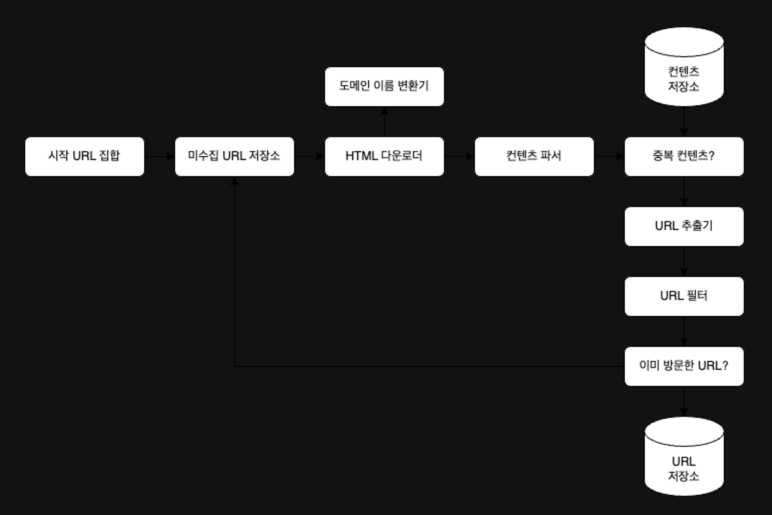

## 첫장
기업들은 시스템 설계 면접을 광범위하게 시행하고 있는데, 의사소통 및 문제 해결 능력이 소프트웨어 엔지니어가 업무상 필요로하는 능력과 비슷해서다.

'모호한 문제'를 어떻게 분석하고 단계적으로 해결하는지를 살펴보게 된다.
문제 해결 아이디어를 어떻게 설명하고 토론하는지, 그리고 그 아이디어를 어떻게 평가하고 개선하는지도 중요하게 따진다.

시스템 설계시 파악해야하는 중요 포인트들
- 시스템 요구사항
- 제약사항
- 성능 병목지점

## 1. 사용자 수에 따른 규모 확장성

## - 단일서버

모든 컴포넌트가 하나의 서버에서 실행될때

_한대에 웹, 앱, 데이터베이스, 캐시 등이 전부 한대에서 실행_

1. 사용자는 도메인 이름을 이용하여 웹사이트에 접속. 접속을 위해서는 도메인 이름을 DNS(도메인 이름 서비스)에 질의하여 IP 주소로 변환하는 과정이 필요하다.
2. DNS 조회 결과로 IP주소가 반환. (그림 1-2의 웹서버의 주소)
3. 해당 IP 주소로 HTTP요청이 전달된다.
4. 요청을 받은 웹서버는 HTML 페이지나 JSON 형태의 응답을 반환한다.
요청은 두가지 단말로 부터 온다. 웹 앱, 모바일 앱
   - 웹 애플리케이션 : 서버 구현용 언어로, 비즈니스 로직, 데이터 저장 등을 처리
   - 모바일 앱 : 모바일 앱과 웹 서버간 통신을 위해 **HTTP 프로토콜** 이용 HTTP 프로토콜을 통해서 반환될 응답 데이터의 포맷으로는 보통 JSON이 사용됨.

## - 데이터베이스

사용자가 늘면 서버 하나는 웹/모바일 트래픽 처리 용도, 다른 하나는 데이터베이스 용을 둔다.
웹 계층 서버와 데이터베이스 서버를 분리하면 그 각각을 독립적으로 확장해 나갈 수 있게 된다.

- RDBMS : 관계형 데이터베이스
  - 조인 연산
- NO SQL : 
  - 비관계형 데이터베이스. 키-값 저장소, 그래프 저장소, 칼럼 저장소, 문서 저장소.
  - 조인 연산 하지 않는다.

##### 비관계형 데이터베이스가 바람직한 선택일 경우

- 아주 낮은 응답 지연 시간이 요구될 때
- 다루는 데이터가 비정형 (관계형 데이터가 아닐때)
- 데이터(JSON, YAML, XML 등)을 직렬화하거나 역직렬화 할 수 있기만 하면 될때
- 아주 많은 양의 데이터를 저장할 필요가 있을때

### - 수직적 규모 확장 VS 수평적 규모 확장
- Scale up (수직적 규모 확장)
  - 서버에 고사양 자원(더 좋은 CPU, 더 많은 RAM 등)을 추가하는 행위
  - 장점
    - 트래픽의 양이 적을때 비용적으로 효울적
  - 단점
    - 수직적 규모 확장에는 한계가 있다. 한대의 서버에 CPU나 메모리를 무한대로 증설이 불가능
    - 장애에 대한 자동복구(fail over) 방안이나 다중화(re-dundancy) 방안을 제시하지 않는다. 서버에 장애가 발생하면 웹사이트/앱은 완전히 중단
- Scale out (수평적 규모 확장)
  - 더 많은 서버를 추가하여 성능을 개선

### 로드밸런서
- 웹서버에 너무 많은 사용자가 접속하여 한계 상황에 도달하게 되면 응답 속도가 느려지거나 서버 접속이 불가능해진다.
- 부하 분산 집합(load balancing set)에 속한 웹 서버들에게 트래픽 부하를 고르게 분산하는 역할을 한다.

- 사용자는 로드밸런서의 공개 IP주소로 접속한다. > 웹 서버는 클라이언트의 접속을 직접 처리 X
- 보안을 위해, 서버 간 통신에는 **사설 IP주소**가 이용됨.
  - 같은 네트워크에 속한 서버 사이의 통신에만 쓰일 수 있는 IP 주소, 인터넷을 통해서는 접속할 수 없다.
  - 로드밸런서는 웹 서버와 통신하기 위해 바로 이 사설 주소를 이용.
- 장점
  - 장애 자동복구하지 못하는 문제(No failover) 해소
    - 서버1이 다운될 때(offline 상태), 모든 트래픽 서버2로 전송.
    - 웹사이트 전체가 다운되는 일이 방지됨
    - 부하를 나누기 위해 새로운 서버를 추가
  - 웹 계층의 가용성(availability) 향상
    - 웹사이트로 유입되는 트래픽이 가파르게 증가하면 두대의 서버로 트래픽을 감당할 수 없는 시점이 오게 되는데, 서버 추가만 하면 로드 밸런스가 자동적으로 트래픽을 분산시켜줌

### 데이터베이스 다중화 
- 서버 사이에 주(Master)-부(slave) 관계를 설정하고 데이터 원본은 주 서버에, 사본은 부 서버에 저장하는 방식.
- 부 데이터베이스는 주 데이터베이스로부터 그 사본을 전달받으며, 읽기 연산만을 지원한다. 
- 데이터베이스를 변경하는 명령어들, 가령 insert, delete, update 등은 주 데이터베이스로만 전달되어야한다.
- 읽기 연산 > 쓰기 연산 (주 데이터베이스 수 < 부 데이터베이스 수)
- 장점
  - 더 나은 성능 
    - 읽기 연산이 부 데이터베이스 서버들로 분산
    - 병렬 처리 될 수 있는 query의 수가 증가됨
  - 안정성
    - 자연 재해 등의 이유로 데이터베이스 서버 가운데 일부가 파괴되어도 데이터는 보존됨.
    - 데이터를 지역적으로 떨어진 여러 장소에 다중화 시켜놓을 수 있다.
  - 가용성
    - 데이터를 여러 지역에 복제함으로써, 하나의 데이터베이스 서버에 장애가 발생하더라도 다른 서버에 있는 데이터를 가져와 계속 서비스할 수 있음.
- 상황 
  - 주 데이터베이스 서버 다운
    - 한대의 부 데이터베이스만 있는 경우 해당 부 데이터베이스 서버가 새로운 주 서버가 됨.
    - 부 서버에 보관된 데이터가 최신 상태가 아닐 수 있기 때문에, 없는 데이터는 복구 스크립트를 돌려서 추가해야한다.
    - 다중 마스터나 원형 다중화 방식을 도입

## - 캐시

응답시간은 캐시를 붙이고 정적 콘텐츠를 콘텐츠 전송 네트워크(Content Delivery Network, CDN)로 옮기면 개선할 수 있다.

웹 페이지를 새로고침할 때마다, 표시할 데이터를 가져오기 위해 데이터베이스 호출이 발생한다. 애플리케이션 성능은 데이터베이스를 얼마나 자주 호출하느냐에 크게 좌우됨.
캐시는 이런 문제를 해결할 수 잇다.

### 캐시 계층

데이터가 잠시 보관되는 곳. 

캐시를 두었을때의 이점
- 애플리케이션의 성능 개선
- 데이터베이스 부하 줄일 수 있다.
- 캐시 계층의 규모 독립적 확장 가능

#### 방법
1. 웹서버는 캐시에 응답이 저장되어있는지 확인
2. 저장되어 있다면 해당 데이터를 클라이언트에 반환
3. 없다면, 데이터베이스 질의를 통해 데이터를 찾아 캐시에 저장한 뒤 클라에게 반환

#### 주도형 캐시 전략(read-through caching strategy)
캐시할 데이터 종류, 크기, 액세스 패턴에 맞는 캐시 전략을 선택

#### 캐시 사용시 유의할 점
- 어떤 상황에 캐시를 사용하는가?
  - 데이터 갱신은 자주 일어나지 않지만, 참조는 빈번하게 일어날 경우
- 어떤 데이터를 캐시에 두어야하는가?
  - 캐시는 데이터를 휘발성 메모리에 둔다. (캐시 서버 재시작 시 캐시 내의 모든 데이터 사라짐)
  - 영속적으로 보관할 데이터를 캐시에 두는 것은 바람직하지 않다.
  - 중요한 데이터는 Persistent Data Store에 두는 것이 바람직
- 캐시에 보관된 데이터는 어떻게 만료?
  - 만료된 데이터는 캐시에서 삭제되어야한다. 만료 정책이 없으면 데이터는 캐시에 계속 남게 된다.
  - 만료기간이 너무 짧으면, 데이터베이스를 자주 읽게 됨
  - 만료기간이 너무 길면, 원본과 차이날 가능성이 높아짐
- 일관성 유지?
  - 데이터 저장소 저장소의 원본과 캐시 내의 사본이 같은지 여부
  - 저장소의 원본을 갱신하는 연산과 캐시를 갱신하는 연산이 단일 트랜잭션으로 처리되지 않는 경우, 이 일관성을 깨지게 된다.
  - 캐시와 저장소 사이의 일관성을 유지하는 것은 어려운 문제가된다.
- 장애를 대처하는 방법?
  - 캐시 서버를 한대만 두는 경우 해당 서버는 단일 장애 지점(Single Point of Failure) 이 되어버릴 가능성이 있다.
    - 단일 장애 지점 : 어떤 특정 지점에서의 장애가 전체 시스템의 동작을 중단시켜버릴 수 있는 경우
  - 단일 장애 지점을 피하기 위해서는 여러 지역에 걸쳐 캐시 서버를 분산시켜야한다.
- 캐시 메모리?
  - 캐시 메모리가 너무 작으면 액세스 패턴에 따라서 데이터가 너무 자주 캐시에서 밀려나버려 캐시의 성능이 떨어진다.
  - 캐시 메모리를 과할당(overprovision) : 캐시에 보관될 데이터가 갑자기 늘어났을 때 생길 문제도 방지할 수 있게 된다.
- 데이터 방출 정책
  - 캐시가 꽉 차버리게 되었을 경우, 기존 데이터를 내보내야함
  - LRU(Least Recently Used) 마지막으로 사용된 시점이 가장 오래된 데이터를 내보내는 정책
  - LFU(Least Frequently Used) 사용된 빈도가 가장 낮은 데이터를 내보내는 정책
  - FIFO(First in First Out) 가장 먼저 캐시에 들어온 데이터를 가장 먼저 내보내는 정책

## - 콘텐츠 전송 네트워크 (CDN)
CDN은 정적 콘텐츠를 전송하는데 쓰이는, 지리적으로 분산된 서버의 네트워크. 이미지, 비디오, CSS, JavaScript 파일등을 캐시 할 수 있다.
- 정적 콘텐츠(Js, CSS, 이미지 등)은 더이상 웹서버를 통해 서비스하지 않으며, CDN을 통해 제공하여 더 나은 성능을 보장한다.
- 캐시가 데이터베이스 부하를 줄여준다.

- 동적 콘텐츠 캐싱
  - 요청 경로, 질의 문자열, 쿠키, 요청 해더 등의 정보에 기반하여 HTML 페이지를 캐시할 수 있다.
- 정적 콘텐츠 캐시
  1. 사용자가 웹사이트 방문 및 url로 이미지 접근
  2. 그 사용자에게 가장 가까운 CDN 서버가 정적 콘텐츠를 전달
     - 사용자가 서버로부터 멀면 멀수록 웹사이트는 천천히 로드
  3. CDN 서버의 캐시에 해당 이미지가 없는 경우, 서버는 원본 서버에 요청하여 파일을 가져온다.
  4. 원본 서버가 파일을 CDN 서버에 반환한다. 응답의 HTTP 헤더에는 해당 파일이 얼마나 오래 캐시될 수 있는지를 설명하는 TTL(Time to live) 값이 들어있다.
  5. CND 서버는 파일을 캐시하고 사용자에게 반환. TTL에 명시된 시간이 끝날 때까지 캐시

#### CDN 사용시 고려해야할 사항
- 비용 
- 적절한 만료 시한 설정 
- CDN 장애에 대한 대처 
  - CDN 자체가 죽었을 경우, 해당 문제를 감지하여 원본 서버로부터 직접 콘텐츠를 가져오도록 클라이언트에 구성
- 콘텐츠 무효화 
  - 아직 만료되지 않은 콘텐츠라 하더라도 CDN에서 제거 가능
    - CDN 서비스 사업자가 제공하는 API를 이용하여 콘텐츠 무효화
    - 콘텐츠의 다른 버전을 서비스하도록 Object versioning이용
    - 콘텐츠의 새로운 버전을 지정하기 위해서 버전 번호를 인자로 준다.

## 무상태 (stateless) 웹계층

웹계층을 수평적으로 확장하는 방법
- 상태 정보를 관계형 데이터베이스나 NoSQL 같은 지속성 저장소에 보관하고, 필요할 때 가지고 오는것.

#### 상태 정보 의존적 아키텍처

각 클라이언트마다 요청은 항상 같은 서버로 전송되어야한다는 것.

#### 무상태 아키텍처

각 클라이언트는 어떤 웹서버로도 HTTP 요청을 보낼 수 있다.
웹 서버는 상태 정보가 필요할 경우 공유 저장소(shared storage)로부터 데이터를 가져온다.
상태 정보는 웹 서버로부터 물리적으로 분리되어있다.

- 세션 데이터를 웹 계층에서 분리하고 지속성 데이터 보관소에 저장하도록 만들었다.
- 공유저장소는 관계형 데이터 베이스일 수도 있고, Memcached/Redis같은 캐시 시스템일 수도 있으며, NoSQL일수 있다.
  - NoSQL은 규모 확장이 간편하다.
  - 자동 규모 확장(autoscaling)은 트래픽 양에 따라 웹 서버를 자동으로 추가하거나 삭제하는 기능을 뜻한다.
  - 상태정보가 웹서버들로부터 제거 되었으므로, 트래픽 양에 따라 서버를 확장하고 축소가 가능

## 데이터 센터
- 지리적 라우팅(geoDNS-routing 또는 geo-routing)
  - 사용자 위치에 따라 도메인 이름을 어떤 IP 주소로 변환할지 결정할 수 있게 해주는 DNS서비스.
  - 하나의 데이터센터중 하나에 심각한 장애가 발생하면, 모든 트래픽은 장애가 없는 데이터 센터로 전송된다.
- 다중 데이터 센터 아키텍처를 만들때의 기술적 난제
  - 트래픽 우회 : geoDNS는 사용자로부터 올바른 데이터 센터로 트래픽을 보내는 효과적인 방법을 찾아야한다.
  - 데이터 동기화 : 데이터 센터마다 별도의 데이터베이스를 사용하면, 장애가 생겨 트래픽이 다른 데이터베이스로 우회된다 하더라도, 해당 데이터 센터에 찾는 데이터가 없을 수 있다.
- 테스트와 배포 : 여러 데이터 센터를 사용하도록 시스템이 구성된 상황이라면, 웹 사이트 또는 애플리케이션을 여러 위치에서 테스트 해보는 것이 중요

## 메세지 큐
- 메세지 큐는 메세지의 무손실(durability)을 보장하는 비동기 통신을 지원하는 컴포넌트.
  - 무손실 : 메세지 큐에 일단 보관된 메세지는 소비자가 꺼낼 때까지 안전히 보관된다는 특성
- 메세지의 버퍼 역할을 하며, 비동기적으로 전송.
- 메세지 큐의 기본 아키텍처
  - 생산자/발행자라고 불리는 입력 서비스가 메시지를 만들어 메시지 큐에 발행.
  - 큐에는 소비자/구독자라 불리는 서버가 연결되어 있음.
- 장점
  - 서비스 또는 서버 간 결합이 느슨해져서, 규모 확장성이 보장되어야하는 안정적 애플리케이션을 구성하기 좋다.
  - 생산자는 소비자 프로세스가 다운되어 있어도 메시지를 발행할 수 있고, 소비자는 생산자 서비스가 가용한 상태가 아니더라도 메시지를 수신할 수 있다.
- 예
  - 이미지 크로핑, 샤프닝, 블러링 등을 지원하는 서진 보정 애플리케이션.
  - 보정은 시간이 오래걸리므로 비동기적으로 처리.
  - 웹서버는 사진 보정 작업을 멧지 큐에 넣는다. 
  - 사진 보정 작업 프로세스들은 이 작업을 메세지 큐에서 꺼내어 비동기적으로 완료한다.
  - 생산자와 소비자 서비스의 규모는 각기 독립적으로 확장될 수 있다.
  - 큐의 크기가 커지면 더 많은 작업 프로세스를 추가해야 처리 시간을 줄일 수 있다.

## 로그, 메트릭 그리고 자동화
- 로그 
  - 에러 로그를 모니터링 하는 것.
  - 시스템의 오류와 문제들을 보다 쉽게 찾아낼 수 있도록 함
  - 에러 로그는 서버 단위로 모니터링 할수도 있지만, 로그를 단일 서비스로 모아주는 도구를 활용하면 더 편리하게 검색 하고 조회 가능
- 메트릭
  - 메트릭을 잘 수입하면 사업 현황에 관한 유용한 정보를 얻을 수도 있고, 시스템의 현재 상태를 손쉽게 파악할 수도 있다.
    - 호스트 단위 메트릭 : CPU, 메모리, 디스크 I/O에 관한 메트릭
    - 종합 메트릭 : 데이터베이스 계층의 성능, 캐시 계층의 성능
    - 핵심 비즈니스 메트릭 : 일별 능동 사용자(DAU), 수익(revenue), 재방문(retention)
- 자동화
  - CI : 개발자가 만드는 코드가 어떤 검증 절차를 자동으로 거치도록 할 수 있어서 문제를 쉽게 감지할 수 있다.
  - 빌드, 테스트, 배포 등의 절차를 자동화할 수 있어 개발 생산성을 크게 향상

#### 메세지 큐, 로그, 메트릭, 자동화 등을 반영하여 수정한 설계안
- 메세지 큐는 각 커포넌트가 보다 느슨히 결합될 수 있도록 하고, 결함에 대한 내성을 높인다.

## 데이터베이스의 규모 확장
저장할 데이터가 많아지면 데이터베이스에 대한 부하도 증가한다. 데이터베이스를 증설할 방법을 찾아야한다.

- 수직적 확장 (Scale up)
  - 기존 서버에 더 많은 **고성능의 자원**(CPU, Ram, 디스크)등을 증설하는 방법
  - 데이터베이스 서버 하드웨어에는 한계가 있으므로 CPU, RAM 등을 무한 증설할 수는 없다.
  - SPOF(Single Point of Failure)로 인한 위험성이 크다.
  - 비용이 많이 든다. 고성능 서버로 갈수록 가격이 올라가기 마련.
- 수평적 확장(Scale out, Sharding)
  - 더 많은 **서버를 추가**함으로써 성능을 향상시킬 수 있도록 한다.
    - Sharding : 데이터베이스를 샤드라고 부르는 작은 단위로 분할하는 기술
    - 모든 샤드는 같은 스키마를 사용. 샤드에 보관되는 데이터 사이에는 중복이 없음
- 샤딩키(파티션 키) 
  - 샤딩 전략을 구현할때 고려해야하는 가장 중요한 것
  - 샤딩 키를 정할 때는 데이터를 고르게 분할 할 수 있도록 하는게 가장 중요
  - 샤딩 키를 통해 올바른 데이터베이스에 질의를 보내어 데이터 조회나 변경을 처리하므로 효율을 높일 수 있다.
  1. 데이터의 재 샤딩
     - 데이터가 너무 많아져서, 하나의 샤드로 감당이 어려울 때
     - 샤드간 데이터 분포가 균등하지 못해, 할당된 공간 소모가 다른 샤드에 비해 빨리 진행될 때, 샤드 소진 현상이 발생하며, 샤드키를 계산하는 함수를 변경하고 데이터를 재배치해야함.
     - 안정 해시 기법을 활용해 문제 해결할 수 있다.
  2. 유명인사 문제 (hotspot key)
     - 특정 샤드에 질의가 집중되어 서버에 과부하가 걸리는 문제
     - 유명인사들만 저장되어있는 샤드는 read 연산 때문에 과부하가 걸리게 될 것.
     - 유명인사 각각에 샤드 하나씩을 할당해야할 수도 있고, 더 잘게 쪼개야할 수 있다.
  3. 조인과 비정규화
     - 하나의 데이터베이스를 여러 샤드 서버로 쪼개고 나면, 여러 샤드에 걸친 데이터를 조인하기 힘들어진다.
     - 데이터베이스 비정규화를 통해 질의가 수행될 수 있도록 한다.

## 백만 사용자, 그리고 그 이상
시스템의 규모를 확장하는 것은 지속적이고 반복적인 과정이다. 
수백만 사용자 이상을 지원하려면 새로운 전략의 도입이 필요하다.
- 웹 계층은 무상태 계층으로
- 모든 계층에 다중화 도입
- 가능한 한 많은 데이터를 캐시할 것
- 여러 데이터 센터를 지원할 것
- 정적 콘텐츠는 CDN을 통해 서비스할 것
- 데이터 계층은 샤딩을 통해 그 규모를 확장할 것
- 각 계층은 독립적 서비스로 분할할 것
- 시스템을 지속적으로 모니터링하고, 자동화도구들을 활용할 것

